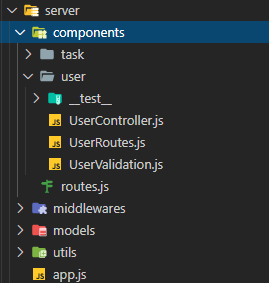
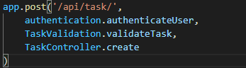
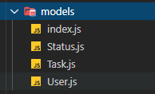

# ARQUITECTURA LIMPIA EN NODEJS (API)

## Requisito previos

* Tener dos base de datos creadas (nodejs y nodejs_test)
* Poner permisos base de datos root en el archivo .env-cmdrc

### Instalación rápida

```bash
npm install
npm run reset-database
npm run dev
```

### Ejecutar pruebas

```bash
npm run test
```

## Tabla de contenido

[1. Arquitectura en componentes](#headers)

[2. Validaciones](#validations)

[3. Middlewares](#middlewares)

[4. Test reutilizables](#tests)

[5. Manejo de errores](#error-handler)

[6. Variables](#variables)


<a name="architecture-base-components"/>

## Arquitectura en componentes

La arquitectura base es componentes, cada carpeta representa un componente, en este caso tareas y usuario.



No significa que representen cada tabla en la base de datos, estos depende de los requisitos del software.

La arquitectura en componentes se escogió para tener un orden más intuitivo para cambiar un requisito. Si estuviera separá en carpetas diferentes al querer realizar un cambio se tendría que encontrar, abrir cada carpeta y buscar el archivo deseado, esto puede tomar mas tiempo.

<a name="validations"/>

## Validaciones


En las rutas existe el concepto de "pasarse la bola", gracias a ello se puede realizar una cascada de filtración de datos.



Primero: Se puede verificar si es un usuario autenticado

Segundo: Satinizar o validar los datos de entrada del usuario

Tercero: Realizar las operaciones del controlador y la base de datos


<a name="middlewares"/>

## Middleware

Son intermediarios entre datos del cliente y la lógica del servidor. Dentro de ella está la validación de usuario.


## Modelos

Los modelos o entidades si representan las tablas en la base de datos.




<a name="tests"/>

## Test de integración reutilizables

Cuando se realiza un test integración se comprueba que los datos se almacenaron correctamente en la base de datos y los servicios funcionen bien. Si una tabla depende de otra por ejemplo tareas y usuario se tiene que hacer el registro del usuario primero. Entonces es necesario hacer los test reutilizables.

Una buena práctica es tener los test en cada componente, estos se dividen en dos:

* Request: Son las solicitudes al API

* Test: Maneja las solicitudes para comprobar el estado

  

Ejemplo de Request "UserRequest.js"

```js
const userData = {
    username: "carlos",
    password: "carlos123",
}

class UserRequests {
    constructor(appReq) {
        this.appReq = appReq
    }

    async create() {
        const apiRes = await this.appReq.post('/api/user/').send({
            ...userData
        })
        return apiRes
    }
	...
}

module.exports = (arg1) => { return new UserRequests(arg1) }
```

Ejemplo de Test "UserTest.js"

```js
const request = require('supertest')
const app = require('../../../app')

const appReq = request(app)

const { User } = require('../../../models')

const UserRequests = require('./UserRequests')(appReq) // Uso de los request

beforeEach(async()=>{
    await User.destroy({where:{},truncate:true})
})

test('Should register a user', async() => {
    const res = await UserRequests.create() // Esperamos la respuesta
    expect(res.status).toBe(201)
    expect(typeof res.body.token).toBe('string')
})
```


Ahora se reutiliza el registro de usuario para registrar una tarea "TaskTest.js"

```js
require('../../../utils/constants')
const {Op} = require('sequelize')

const request = require('supertest')
const app = require('../../../app')

const appReq = request(app)

const { User, Task } = require('../../../models')

const TaskRequests = require('./TaskRequests')(appReq)
const UserRequests = require('../../user/__test__/UserRequests')(appReq) // Reutilización

let token = null

beforeEach(async()=>{
    await User.destroy({where:{},truncate:true})
    await Task.destroy({where:{},truncate:true})
    const res = await UserRequests.create() // Se crea un usuario antes de cada test
    token = res.body.token
})

test('Should register a task', async() => {
    const res = await TaskRequests.create(token)
    expect(res.status).toBe(201)
})
```


<a name="error-handler"/>

## Manejo de errores global

Si ocurre un error fatal es necesario enviar un mensaje al administrador o guardarlo en un log.

Por ello se uso express-async-handler que envuelve cualquier función y está a la escucha de errores.

Se usó en los controladores

```js
const asyncHandler = require('express-async-handler')
exports.create = asyncHandler(async (req, res) => {
    ... 
})
```

Cualquier error dentro de la función asyncHandler será reportada.

Por ello en el archivo app.js se puede manejar todos los errores de la aplicación

```js
...
app.use(async(err, req, res, next) => {
    const {isOperationalError, httpCode, description} = await handleError(err);
    console.log({isOperationalError, httpCode, description})
    res.status(httpCode).send(description)
})
```

handlerError maneja todos los errores encapsulados


## Crear y poblar base de datos rápidamente

Si ejecuta el comando

```bash
npm run reset-database
```

El software se encargará de vaciar => crear tablas y poblarlas con datos estáticos.


<a name="variables"/>

## Variables globales en la base de datos

Comparemos dos códigos para desabilitar un usuario con un ORM.

Ejemplo 1:

```js
await Task.update({
    FKStatus: 2,
}, { where: { Id: id } })
```

Ejemplo 2:

```js
await Task.update({
    FKStatus: global.STATUS.INACTIVE,
}, { where: { Id: id } })
```

En la base de datos 1 es activo y 2 es inactivo

El ejemplo 1 no es intuitivo, si luego de una semana lo miras talvéz no te acuerdes que rayos significa 2.

El ejemplo 2 es más intuitivo, por lo tanto es más facil de leer en entender.

